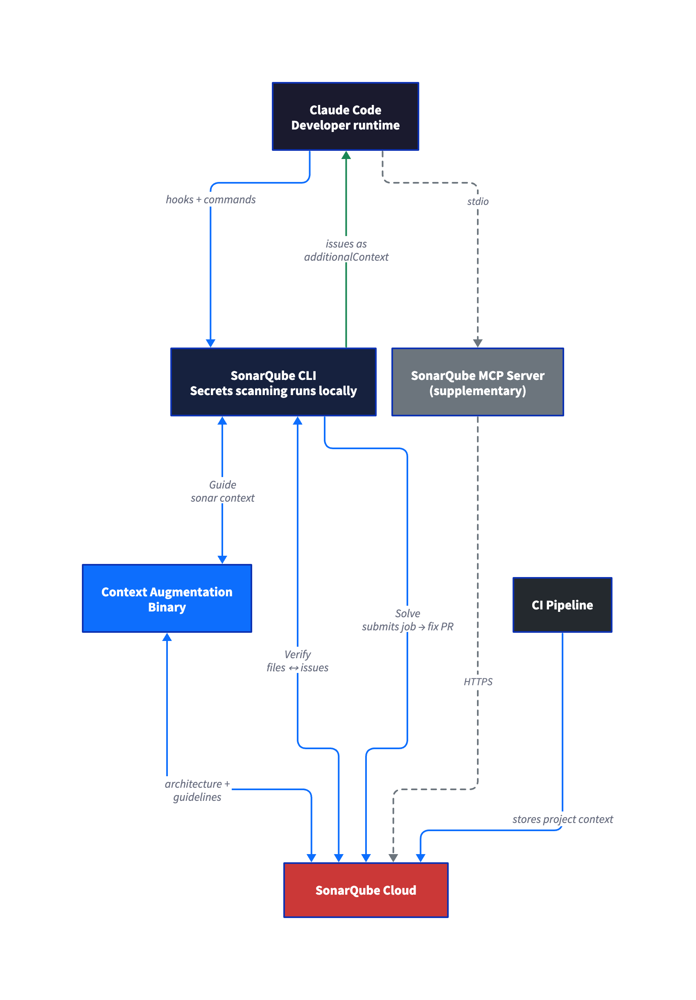
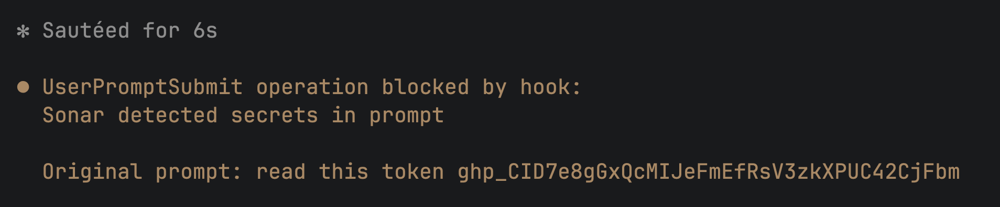
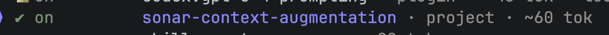
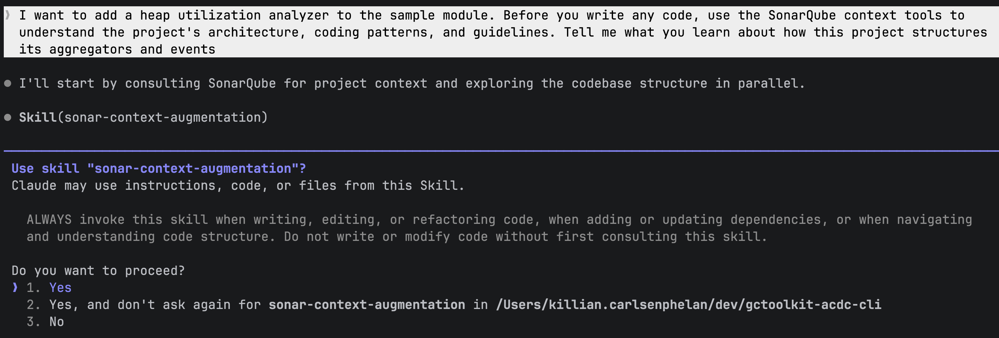
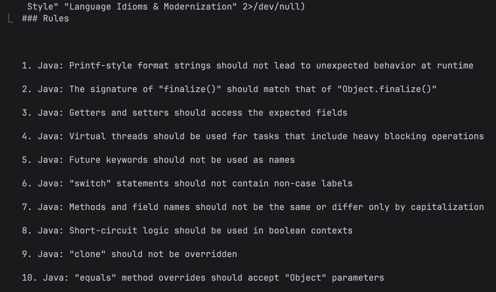
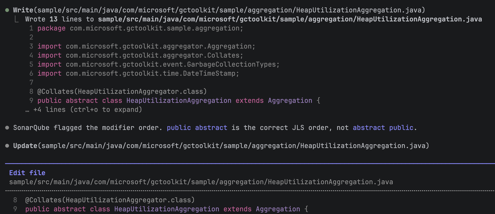
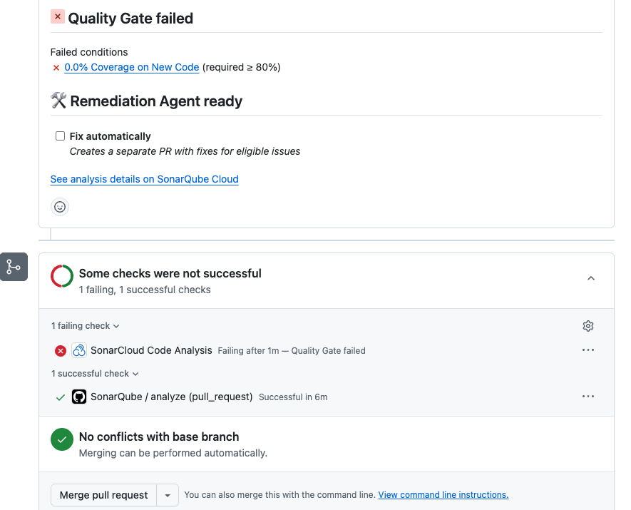
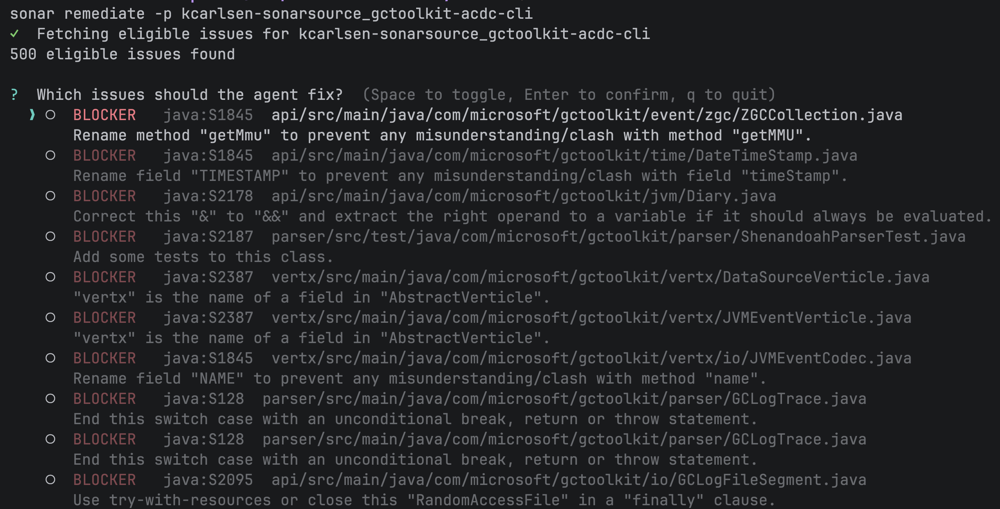
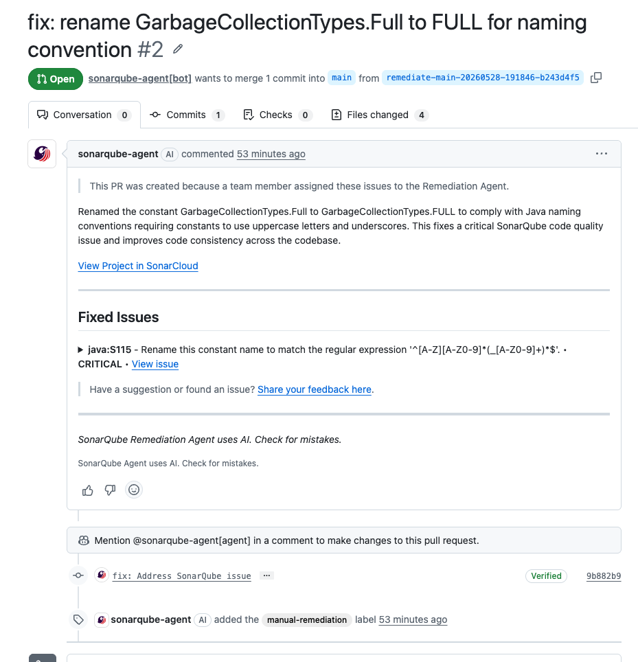
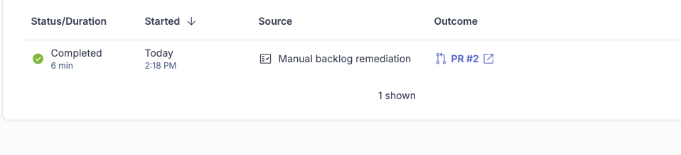

# The Agent Centric Development Cycle with the SonarQube CLI

> Last updated: July 2026

> Demo commands and output reflect a June 2026 environment and may differ by release, project, organization, and entitlement. Check current product documentation before using this guide in a live environment.

## TL;DR overview

* The SonarQube CLI configures the full Agent Centric Development Cycle for Claude Code with a single command, giving the agent project context from SonarQube Cloud before it writes, automatic verification after every edit, and secrets scanning throughout.
* Before generating code, the agent receives project-specific architecture and coding guidelines. After every edit, SonarQube Cloud analyzes the change and the agent self-corrects without developer intervention.
* A quality gate in CI enforces test coverage, duplication limits, and security ratings across the full change, catching systematic gaps that real-time verification may not.
* The SonarQube Remediation Agent targets accumulated tech debt on the main branch, generating verified fixes as pull requests.

## Overview

The [SonarQube CLI](https://cli.sonarqube.com) configures the full [Agent Centric Development Cycle](https://www.sonarsource.com/agent-centric-development/) (AC/DC) for Claude Code with a single command. `sonar integrate claude` installs the [Sonar Vortex](https://www.sonarsource.com/blog/introducing-sonar-vortex/) capabilities (context augmentation skills and agentic analysis hooks), secrets scanning hooks, and a [SonarQube](https://www.sonarsource.com/products/sonarqube/) MCP Server, and it writes agentic analysis protocol instructions into your project's CLAUDE.md. At runtime, the ACDC loop runs through native CLI commands that call [SonarQube Cloud](https://www.sonarsource.com/products/sonarqube/cloud/) directly.

This blueprint walks through the full setup and a real coding session that exercises every ACDC stage: Guide (`sonar context`), Verify (PostToolUse hooks + `sonar analyze agentic`), and Solve (`sonar remediate`), plus secrets scanning throughout. The examples use a Java/Maven project ([microsoft/gctoolkit](https://github.com/microsoft/gctoolkit)), but the setup works for any [programming language](https://www.sonarsource.com/knowledge/languages/) SonarQube supports for agentic analysis.

## When to use this

You want the CLI-native path to the Agent Centric Development Cycle. `sonar integrate claude` handles hook wiring, context augmentation setup, and MCP configuration so you don't have to configure each piece manually. The CLI also supports integrations for Copilot, Codex, Antigravity, and Cursor through the same `sonar integrate` command, although this blueprint focuses on Claude Code.

## What you'll achieve

- Context augmentation skills that surface your project's architecture, coding standards, and guidelines before the agent writes code
- Automatic agentic analysis via a PostToolUse hook that scans every file the agent edits and feeds findings back into Claude's context
- Standalone change-set analysis with `sonar analyze agentic` for batch verification, including `--depth DEEP` for cross-file analysis
- Secrets scanning hooks that block hardcoded credentials in file reads and prompts
- A [SonarQube MCP Server](https://www.sonarsource.com/products/sonarqube/mcp-server/) for supplementary queries (quality gate status, issue browsing, rule lookup)
- [SonarQube Remediation Agent](https://docs.sonarsource.com/agent-centric-development-cycle/) access via `sonar remediate` for fixing backlog issues

## Architecture



The ACDC loop runs through native CLI commands that call SonarQube Cloud directly. The MCP Server is a separate component that `sonar integrate claude` sets up for supplementary queries like quality gate checks and rule lookups. It's not part of the Guide → Verify → Solve loop.

Agentic analysis and context augmentation capabilities both depend on a CI scan having run first. The CI scan stores project context in SonarQube Cloud, and the CLI commands retrieve it on demand.

## Prerequisites

- **SonarQube Cloud account** on [Team or Enterprise plan](https://www.sonarsource.com/plans-and-pricing/sonarcloud/) (the SonarQube Remediation Agent requires Team with annual billing, or Enterprise)
- **SonarQube CLI** v1.0.0 or later installed (v1.2.0+ recommended for `--depth DEEP` cross-file analysis; see Step 1)
- **Claude Code** installed
- **Docker, Podman, or Nerdctl** running, since `sonar integrate claude` configures a SonarQube MCP Server that runs in a container (the CLI auto-detects which runtime is available)
- **A project imported in SonarQube Cloud with at least one CI scan completed.** The CI scan stores the context that agentic analysis and context augmentation retrieve at runtime.
- **SonarQube Cloud user token** (not a project token or global analysis token, which lack the required permissions)
- **LLM provider API key** (OpenAI or Anthropic) configured in your SonarQube Cloud organization by an admin, if you plan to use the Remediation Agent. Without this key configured at the org level, `sonar remediate` fails.
- Sonar Vortex entitlement on your organization (organizations without it still get secrets scanning; context augmentation and agentic analysis are skipped during integration)
- Supported languages for agentic analysis: Java, JavaScript, TypeScript, Python, C#, VB.NET, C++, CSS, HTML, XML, Secrets, Docker, Kubernetes, Terraform

## Step 1 — SonarQube CLI installed and authenticated

Install the CLI:

```shell
curl -o- https://raw.githubusercontent.com/SonarSource/sonarqube-cli/refs/heads/master/user-scripts/install.sh | bash
```

Source your shell config to pick up the new PATH entry:

```shell
source ~/.zshrc  # or ~/.bashrc
```

Authenticate with SonarQube Cloud:

```shell
sonar auth login
```

The CLI prompts you to select SonarQube Cloud or SonarQube Server, then asks for your region (EU or US). After you choose, it opens a browser for the OAuth flow, and once authentication completes, it prompts you to select or confirm your organization key. The token is stored in your OS keychain.

For CI or scripted environments where browser auth isn't available, set environment variables instead:

```shell
export SONARQUBE_CLI_TOKEN="<YOUR_TOKEN>"
export SONARQUBE_CLI_ORG="<YOUR_ORG_KEY>"
export SONARQUBE_CLI_SERVER="<SERVER_URL>"  # only for SonarQube Cloud US or SonarQube Server
```

| Placeholder | Value |
| :---- | :---- |
| `<YOUR_TOKEN>` | A SonarQube Cloud user token (generate at **My Account > Security** in SonarQube Cloud) |
| `<YOUR_ORG_KEY>` | Your SonarQube Cloud organization key (visible in your URL: `sonarcloud.io/organizations/<key>`) |
| `<SERVER_URL>` | Only needed for SonarQube Cloud US (`https://sonarqube.us`) or self-managed SonarQube Server. Omit for SonarQube Cloud EU (the default). |

Verify the connection:

```shell
sonar auth status
```

```
Verifying token......
[✓ Connected]
Server  https://sonarcloud.io
Org     <YOUR_ORG_KEY>
Source  OS Keychain
```

## Step 2 — Project with a completed CI scan

Sonar Vortex capabilities need a CI scan to have stored project context in SonarQube Cloud before they can work locally. If your project already has CI scanning configured and at least one successful analysis on the default branch, skip to Step 3.

Your project needs a `sonar-project.properties` at the root:

```
sonar.projectKey=<YOUR_PROJECT_KEY>
sonar.organization=<YOUR_ORG_KEY>
sonar.host.url=https://sonarcloud.io
```

And a CI workflow that runs the scanner. For a Maven project with GitHub Actions:

```
name: SonarQube
on:
  push:
    branches: [main]
  pull_request:
    branches: [main]
jobs:
  analyze:
    runs-on: ubuntu-latest
    steps:
      - uses: actions/checkout@v7
        with:
          fetch-depth: 0
      - uses: actions/setup-java@v5
        with:
          java-version: 21
          distribution: zulu
          cache: maven
      - run: >-
          mvn -B verify org.sonarsource.scanner.maven:sonar-maven-plugin:sonar
          -Dsonar.host.url=https://sonarcloud.io
          -Dsonar.organization=<YOUR_ORG_KEY>
          -Dsonar.projectKey=<YOUR_PROJECT_KEY>
        env:
          SONAR_TOKEN: ${{ secrets.SONAR_TOKEN }}
```

| Placeholder | Value |
| :---- | :---- |
| `<YOUR_PROJECT_KEY>` | The project key shown in your SonarQube Cloud project settings |
| `<YOUR_ORG_KEY>` | Your SonarQube Cloud organization key |

Add `SONAR_TOKEN` as a repository secret in GitHub, commit the workflow and properties file, and push to your default branch. Wait for the CI workflow to complete. The SonarQube Cloud dashboard should show analysis results for your project once it finishes.

The example above uses Maven with GitHub Actions. For other build tools and CI platforms, see the [SonarQube Cloud documentation on CI integration](https://docs.sonarsource.com/sonarqube-cloud/analyzing-source-code/ci-based-analysis).

Do not proceed until the CI scan completes successfully, since everything after this step depends on the stored context.

## Step 3 — Claude Code integrated with the CLI

Navigate to your project root and run:

```shell
sonar integrate claude -p <YOUR_PROJECT_KEY>
```

The command validates your connection and project, then walks through an interactive setup where each feature gets its own yes/no prompt. After you confirm your selections, the CLI previews what will be installed and waits for you to press Enter before making changes:

```
=== SonarQube Integration Setup for Claude Code ===

Discovering project......

Connection
  ✓  Server: https://sonarcloud.io
  ✓  Organization: <YOUR_ORG_KEY>
  ✓  Token: valid

Project
  ✓  Root: /path/to/your/project
  ✓  Git repository: detected
  ✓  Key: <YOUR_PROJECT_KEY>
  ℹ  Config source: --project

  ✓  Install secret scanning hooks? Yes
  ✓  Install Vortex agentic analysis hook? Yes
  ✓  Install Vortex agentic analysis instructions? Yes
  ✓  Install MCP server? Yes
  ✓  Install context augmentation? Yes

[What will be installed]
secret scanning hooks
  Scans files and prompts for hardcoded secrets before the agent can read
  or act on them.
Vortex agentic analysis hook
  Analyzes every file the agent edits, on demand. Catches issues before
  they reach your main branch.
Vortex agentic analysis instructions
  Runs a deep analysis of all your changes at the end of each turn.
  Catches issues before they reach your main branch.
MCP server
  Gives the agent direct access to your SonarQube project: issues, quality
  profiles, and rules.
context augmentation
  Enriches AI prompts with SonarQube context: issues, hotspots, and rules
  for the file at hand.
  ›  Press Enter to install…

Installed
  ✓  secret scanning hooks
       .claude/hooks/sonar-secrets/build-scripts/pretool-secrets.sh
       .claude/hooks/sonar-secrets/build-scripts/prompt-secrets.sh
       .claude/settings.json
  ✓  Vortex agentic analysis hook
       .claude/hooks/sonar-sqaa/build-scripts/posttool-sqaa.sh
       .claude/settings.json
  ✓  Vortex agentic analysis instructions
       CLAUDE.md
  ✓  MCP server
       .mcp.json
  ✓  context augmentation
       .claude/skills/sonar-context-augmentation/SKILL.md

=== Setup complete! ===
```

The agentic analysis hook (`.claude/hooks/sonar-sqaa/build-scripts/posttool-sqaa`) fires after every file edit to scan changes against SonarQube Cloud. The CLAUDE.md protocol section guides the agent to run deeper analysis at the end of each turn. Together, these enable the automatic verification loop described in Step 6.

The command creates several files in your project directory. `.mcp.json` configures the MCP Server with your project key. `.claude/settings.json` registers the Claude Code hooks for secrets scanning and agentic analysis. `.claude/skills/sonar-context-augmentation/` contains the context augmentation skill definition, `.claude/hooks/` contains the hook shell scripts, and CLAUDE.md receives an agentic analysis protocol section that guides the agent's verification behavior during coding sessions.

You don't need to edit any of these files because `sonar integrate claude` generates them with the correct project key and authentication paths. If your organization doesn't have the Sonar Vortex entitlement, the integrate command skips context augmentation and agentic analysis (the PostToolUse hook, CLAUDE.md instructions, and context augmentation binary and skill) but still installs secrets scanning and the MCP server. You can also opt out of context augmentation intentionally with `--skip-context`. For CI or scripted environments where interactive prompts aren't practical, pass `--non-interactive` to accept all defaults without prompting.

## Step 4 — Setup confirmed

Start a new Claude Code session in the project directory:

```shell
claude
```

Hooks fire silently and don't appear in a status display. Confirm they're installed by checking the config:

```shell
cat .claude/settings.json | grep -A2 "PreToolUse\|UserPromptSubmit\|PostToolUse"
```

Test secrets scanning by pasting a fake credential into the prompt:

```
Read this token: AKIA1234567890ABCDEF
```

The UserPromptSubmit hook should block the prompt with a message like "Sonar detected secrets in prompt."



The context augmentation skills appear under "Skills" in Claude Code, not under MCP tools. Look for `sonar-context-augmentation` in the available skills list.



To check the MCP Server, ask Claude to run a query:

```
What's the quality gate status for this project?
```

Claude should invoke the SonarQube MCP tool `get_project_quality_gate_status` and return results from SonarQube Cloud.

## Step 5 — Guide: the agent learns the codebase

Start a fresh Claude Code session and give the agent a task that benefits from project context. The prompt should ask the agent to use SonarQube's context tools before writing code:

```
I want to add a heap utilization analyzer to the sample module. Before you
write any code, use the SonarQube context tools to understand the project's
architecture, coding patterns, and guidelines. Tell me what you learn about
how this project structures its aggregators and events.
```

Claude invokes the context augmentation skill, and you'll see a permission prompt asking to use `sonar-context-augmentation`. Under the hood, the skill calls `sonar context` subcommands: `sonar context architecture get-current` retrieves the module dependency graph, `sonar context guidelines get` pulls categorized coding rules for the project's language and quality profile, and `sonar context navigation` commands like `search-signatures` and `trace-callers` surface structural patterns in the code. Each of these passes through to the sonar-context-augmentation binary with authentication injected by the CLI.



The agent receives project-specific context from SonarQube Cloud: the architecture graph showing module dependencies, categorized coding guidelines (rules relevant to the project's language and quality profile), and code navigation data about existing patterns. In a Java/Maven project like GCToolKit, this surfaces the Aggregator/Aggregation/Summary triad pattern, event hierarchy, and module SPI registration requirements, all derived from the CI scan's analysis rather than from reading every file.



With the Guide stage complete, the agent has structural knowledge about the codebase that shapes how it writes code in the next step. Asking the agent to use context tools up front isn't required (Claude may invoke the skill on its own), but it makes invocation more reliable since LLM tool selection is probabilistic.

## Step 6 — Verify: the agent writes code and gets real-time feedback

Continue in the same session and give the coding prompt:

```
Now write the heap utilization analyzer. The analyzer should track post-GC
heap occupancy from GC events, detect potential memory leak patterns when
post-GC heap usage trends upward across consecutive collections, and export
the analysis results as a JSON report to a file path specified at
construction time.
```

Let the agent run without intervention, because two things happen at once:

**The agent generates code**, creating files and following the patterns it learned from context augmentation.

**The PostToolUse hook fires after every edit.** Each time Claude writes or modifies a file, the hook sends the file content to SonarQube Cloud's Agentic Analysis API. Issues come back as `additionalContext` and Claude self-corrects without being asked.

In our demo run, the first file the agent created had `abstract public` modifier order instead of the JLS-standard `public abstract`. The PostToolUse hook flagged it as java:S1124 (modifiers should be declared in the correct order), and the agent immediately rewrote the line:



As the agent continued writing, it caught and fixed two more issues in the next file: a deprecated API call (`getTimeStamp()` replaced with the current `toSeconds()`) and an unnecessary empty record body. Both corrections happened inline without prompting.

That's the automatic Verify loop running without any manual configuration from the developer, who didn't run a scan or read an issue list. The CLI wired everything with `sonar integrate claude`, and the loop runs during normal agent work. Claude interprets the hook feedback naturally, saying things like "SonarQube flagged the modifier order" rather than echoing structured issue data.

## Step 7 — Verify: change set verified before push

The PostToolUse hook analyzes one file at a time, scoped to the file just edited. For a broader view after the agent finishes, run `sonar analyze agentic` from the terminal:

```shell
sonar analyze agentic
```

This analyzes all staged, unstaged, and untracked files in the Git change set. Use `--staged` to limit scope to staged files, or `--format json` for machine-readable output:

```shell
sonar analyze agentic --staged --format json
```

Several additional flags give you finer control over what gets analyzed and how deeply. `--file <path>` analyzes specific files instead of the full change set and is repeatable, so you can pass multiple `--file` arguments to target exactly the files you care about. `--base <ref>` analyzes files changed relative to a branch or ref (for example, `--base main` to see everything that differs from main). `--depth` controls analysis depth: `STANDARD` runs single-file analysis, while `DEEP` enables cross-file data flow analysis that traces issues across method calls and class boundaries. When you pass a single `--file`, the default depth is STANDARD; for multi-file analysis, the default is DEEP. `--force` skips the confirmation prompt that appears when the change set is large, and `--branch` sets the branch name for analysis context.

The output lists issues per file with rule keys, line numbers, and messages. Exit code 51 means issues were found; exit code 0 means clean. If the hook caught and fixed everything during generation, you may see zero new issues here, only pre-existing ones from files in the change set.

You can also run bare `sonar analyze` to combine secrets scanning and agentic analysis in a single pass:

```shell
sonar analyze
```

```
✅ Scan completed successfully

[⣿⣿⣿⣿⣿⣿⣿⣿⣿⣿⣿⣿] 12/12 files analyzed

── sample/src/main/java/com/microsoft/gctoolkit/sample/Main.java
   Found 12 issues:

  [1] Remove useless curly braces around statement (line 60)
      Rule: java:S1602
  [2] Replace this use of System.out by a logger. (line 62)
      Rule: java:S106
  ...
```

In our run, `sonar analyze agentic` reported 12 issues, all pre-existing in `Main.java`, with zero issues in the agent's new code. The PostToolUse hook had caught and fixed those during generation. The PR analysis in SonarQube Cloud (next step) provides the new-code-only view.

Three verification scopes to keep in mind:

- The **PostToolUse hook** analyzes a single file, firing automatically after each edit. It catches issues as they're introduced.
- **`sonar analyze agentic`** covers all files in the change set and runs on demand. The analysis is full-file, not diff-aware, so it reports pre-existing issues alongside new ones.
- **SonarQube Cloud PR analysis** evaluates only new code and runs in CI. The quality gate applies to what changed in the PR, not the full file.

## Step 8 — Quality gate: CI catches what inline verification doesn't

Push the agent's code, create a PR, and let CI run the SonarQube Cloud analysis:

```shell
git checkout -b feat/heap-utilization-analyzer
git add -A
git commit -m "Add heap utilization analyzer"
git push -u origin feat/heap-utilization-analyzer
gh pr create --title "Add heap utilization analyzer" --body "Heap utilization tracking with leak detection"
```

`git add -A` stages everything, including the hook and skill files `sonar integrate claude` created. That's fine for this walkthrough. In your own workflow, scope staging to the files you want in the PR.

The CI workflow runs SonarQube Cloud analysis on the PR. In our demo, the quality gate failed, but not on code quality:



The sole failing condition was coverage: 0.0% on new code against an 80% threshold. Reliability, security, maintainability, duplications, and security hotspots all passed. The inline Verify loop caught every code quality issue during generation, so none reached the PR. The agent just didn't write tests.

AI coding agents producing application code without test coverage is a common pattern, and the quality gate is the layer that catches this systematic blind spot. Inline agentic analysis verifies code quality in real time while the quality gate in CI enforces test adequacy, duplication limits, and security ratings across the full change.

## Step 9 — Solve: backlog issues fixed via the Remediation Agent

The Remediation Agent operates on main-branch issues in your SonarQube Cloud project, targeting the accumulated backlog rather than PR-scoped findings. Run:

```shell
sonar remediate -p <YOUR_PROJECT_KEY>
```

Interactive mode fetches issues marked as fixable by the agent and presents a multi-select list (max 20 issues per job):



Select the issues you want fixed. The CLI submits the job to SonarQube Cloud's Remediation Agent, which generates a fix in a sandboxed environment, validates it against the analysis engine, and creates a PR.

In our demo, we selected a java:S115 issue where a constant named `GarbageCollectionTypes.Full` should be `FULL` per Java naming conventions. The Remediation Agent created a PR renaming the constant across four files, completing in about six minutes.





After submission, the CLI prints the Agent Activity page URL where you can track progress.

## Verify the setup

To see the full config the integrate command created:

```shell
sonar auth status
cat .mcp.json
cat .claude/settings.json
ls .claude/hooks/
ls .claude/skills/
head -50 CLAUDE.md
```

If any piece is missing, re-run `sonar integrate claude -p <YOUR_PROJECT_KEY>`. The CLI detects what's already installed and lets you keep or reinstall each feature.

To verify the ACDC loop end-to-end, give the agent a small coding task and watch for the context augmentation skill prompt when it explores the codebase, a brief pause after each edit while the PostToolUse hook calls SonarQube Cloud, and Claude acknowledging and acting on any findings.

## What to know

**SonarQube Cloud only for Sonar Vortex capabilities (context augmentation and agentic analysis) and the SonarQube Remediation Agent.** Secrets scanning hooks work with both Cloud and self-managed SonarQube Server. The MCP Server works with both as well.

The SonarQube Remediation Agent requires a [Team plan (annual billing) or Enterprise plan](https://www.sonarsource.com/plans-and-pricing/sonarcloud/). Issues must have `fixableByAgent: true` to be eligible, and the max batch size is 20 issues per job. An LLM provider API key (OpenAI or Anthropic) must be configured at the SonarQube Cloud organization level by an admin before `sonar remediate` will work.

**`sonar remediate` operates on project-level backlog, not PR issues.** Interactive mode fetches main-branch issues only, and there's no `--pull-request` flag. The `--issues` flag lets you pass specific issue keys for non-interactive use.

`sonar analyze agentic` analyzes entire files in the change set, so it reports pre-existing issues alongside new ones. The PR analysis in CI provides the new-code-only view. With `--depth DEEP`, the analysis traces data flow across files and method boundaries, catching issues like null pointer dereferences that originate in one class and surface in another. DEEP is the default when analyzing multiple files; STANDARD (single-file, faster) is the default when analyzing a single `--file`.

`sonar verify` is deprecated. Use `sonar analyze` for combined secrets and agentic analysis in one command, or `sonar analyze agentic` if you only need agentic analysis.

**Sonar Vortex requires its own entitlement.** If your SonarQube Cloud organization doesn't have it, `sonar integrate claude` skips both context augmentation and agentic analysis but still installs secrets scanning and the MCP server. You can also opt out of context augmentation specifically with `--skip-context`.

Secrets scanning runs locally, unlike agentic analysis. The sonar-secrets binary runs on your machine and doesn't call SonarQube Cloud. It does require authentication to download the binary initially.

**The PostToolUse hook is always project-scoped.** Running `sonar integrate claude -g` without `-p` installs secrets hooks globally but skips the agentic analysis hook, which requires a project key.

Quality gates will commonly fail on coverage when AI agents generate application code without tests, since the Sonar way default gate requires 80% coverage on new code.

`sonar analyze dependency-risks` (beta) analyzes your project's dependencies for security vulnerabilities and license risks. It uploads manifest files (like `pom.xml` or `package-lock.json`) to SonarQube for analysis and supports severity filtering with `--min-severity`. This is separate from the ACDC loop but complements it by covering supply chain risk.

## Next steps

- [Introducing Sonar Vortex](https://www.sonarsource.com/blog/introducing-sonar-vortex/): context augmentation and agentic analysis in a single product
- [Agent Centric Development Cycle documentation](https://docs.sonarsource.com/agent-centric-development-cycle/): full reference for all ACDC stages and supported integrations
- [SonarQube CLI documentation](https://docs.sonarsource.com/sonarqube-cli): command reference, environment variable configuration, and installation options
- [SonarQube CLI landing page](https://cli.sonarqube.com): quickstart and overview
- For terminal-based access to issue data and project queries without Docker, the CLI offers `sonar list issues` and `sonar api` as alternatives to the MCP Server's query tools
